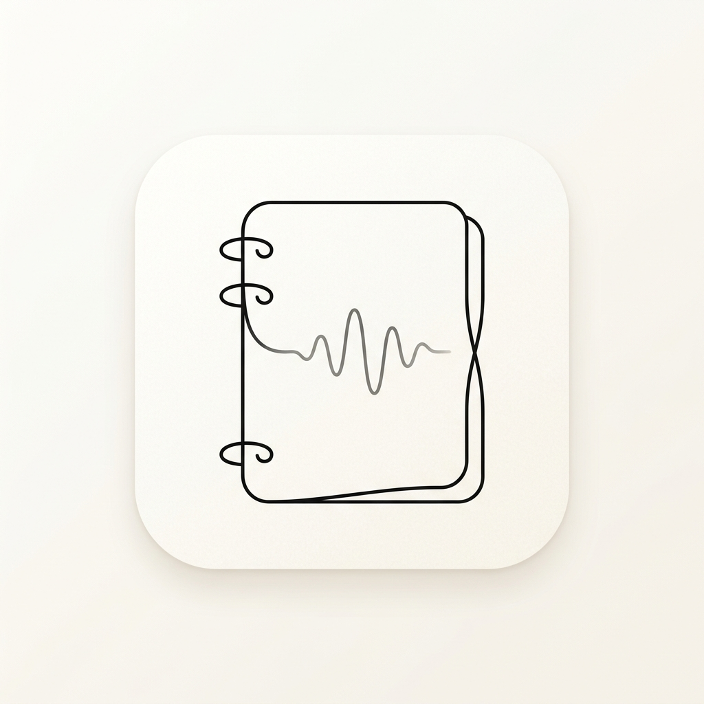

<div align="center">



# Ideatik

**A privacy-first, fully offline voice notebook for Android**  
Captures your thoughts, converts them into structured notes, and lets you query them with local AI — all without a server.

[](https://reactnative.dev)
[](https://www.typescriptlang.org)
[](./package.json)
[](./LICENSE)
[](./CONTRIBUTING.md)

</div>

---

## What Is This?

Ideatik is a React Native Android app that turns your voice into structured, searchable notes — without ever sending data to a cloud. It's built around three ideas:

1. **Voice first** — speak naturally to create notes, checklists, and finance logs
2. **Offline always** — transcription, AI search, and note storage run entirely on-device
3. **Structured output** — raw speech is parsed into typed content (notes / lists / ledgers) using a hybrid rule-based + LLM pipeline

> **Note:** This project was vibe-coded — built iteratively with speed in mind. The code is functional and tested, but there's room to clean up, refactor, and improve in several areas. Contributions that improve maintainability are very welcome.

---

## Features

### Voice Capture
- Record voice in chunks, with pause / resume support
- On-device transcription via `whisper.rn` (Whisper base.en-q5_1, ~60 MB)
- Background transcription queue with crash recovery

### Structured Note Types
| Type | Description |
|------|-------------|
| **Note** | Markdown text with backlink references |
| **Checklist** | Reorderable to-do items with collapsible completed section |
| **Finance Ledger** | Line-item costs with auto-totals, paid/pending status, budget tracking |

### Voice Commands
| Command | Example |
|---------|---------|
| Add checklist item | `add buy groceries` |
| Add multiple items | `add milk add eggs add bread` |
| Add finance item | `add lunch cost two hundred rupees` |
| Link reference | `add reference here` |

### Offline AI (Optional)
- Semantic search across notes using BGE base-en-v1.5 embeddings (~110 MB)
- Natural Q&A and summaries via Qwen 2.5 1.5B (~986 MB)
- Hybrid search: 65% vector similarity + 35% keyword overlap
- Models are user-supplied — download from HuggingFace or import your own GGUF

### Other
- Biometric lock per note (fingerprint / device passcode)
- Export to Markdown, PDF, or raw WAV audio
- Import `.md` / `.txt` Markdown notes
- Full-text search with tag filters
- Dark / light theme
- Masonry grid layout with drag-and-drop reordering

---

## Architecture

```
src/
├── components/       # Shared UI primitives (Typography, ScreenWrapper, etc.)
├── features/         # Zustand state stores
│   ├── notes/        # Note list state
│   ├── recording/    # Recording session state machine
│   ├── settings/     # App preferences (theme, model URIs)
│   ├── security/     # Biometric lock state
│   └── tags/         # Tag management
├── screens/          # Full-page screen components
└── services/
    ├── ai/           # LocalVectorIndex, SmartRagService, OfflineAiModelService
    ├── audio/        # AudioService (WAV capture + concatenation)
    ├── background/   # BackgroundTaskManager (transcription queue)
    ├── database/     # SQLite (DatabaseService, NoteRepository, FilesystemService)
    ├── export/       # ExportService (Markdown / PDF / WAV)
    ├── notes/        # StructuredNoteService (content model)
    ├── parsers/      # HybridVoiceParser, CommandParser, markdownParser
    ├── queue/        # TranscriptionQueue
    └── search/       # SearchService (full-text + tag + date)
```

### Key Design Decisions

- **SQLite for metadata, filesystem for content** — note text is stored as `.md` files on disk; SQLite holds only indexed metadata. This keeps the DB small and queries fast.
- **Vectors stored as compact binary** — embedding vectors are stored as base64-encoded Float32 buffers (~4× smaller than JSON arrays).
- **Wall-clock duration** — recording duration is tracked via a JS timer rather than inferred from audio byte counts, avoiding sample-rate mismatch bugs.
- **Lazy model loading** — Whisper and embedding models are released after each use rather than held in memory.

---

## Tech Stack

| Layer | Library |
|-------|---------|
| Framework | React Native 0.86 |
| Language | TypeScript 5.8 |
| State | Zustand |
| Database | react-native-sqlite-storage + react-native-mmkv |
| Audio capture | react-native-audio-record |
| Transcription | whisper.rn |
| On-device LLM | llama.rn |
| Navigation | React Navigation v7 |
| Icons | Lucide React Native |

---

## Getting Started

### Prerequisites

- Node.js ≥ 22.11
- JDK 17
- Android SDK (API 34+)
- React Native CLI

### Setup

```bash
git clone https://github.com/DarshanAguru/ideatik.git
cd ideatik
npm install

# Android
npx react-native run-android
```

> iOS is not currently supported — some native modules (audio record, whisper.rn) need iOS configuration that hasn't been set up.

### Optional: Enable Offline AI

1. Open the app → Settings → Offline Capabilities & Models
2. Download or import:
   - **Whisper** — auto-downloads (~60 MB) when you first tap the mic
   - **Embeddings** — BGE Base EN v1.5 Q4_K_M (~110 MB)
   - **LLM** — Qwen 2.5 1.5B Instruct Q4_K_M (~986 MB)
3. Models can also be imported from local GGUF files via the Import button

---

## Testing

```bash
npm test
```

Tests cover the voice command parser, hybrid parser, and structured note serialisation.

---

## Contributing

See [CONTRIBUTING.md](./CONTRIBUTING.md) for how to get started.  
Please read [CODE_OF_CONDUCT.md](./CODE_OF_CONDUCT.md) before participating.

---

## Roadmap

- [ ] iOS support
- [ ] Cloud sync (opt-in, end-to-end encrypted)
- [ ] Widget for quick voice capture
- [ ] Shared note collaboration (local network)
- [ ] Export to Notion / Obsidian

---

## License

MIT © [Darshan Aguru](https://github.com/DarshanAguru)

## About

I'm a programming enthusiast who loves exploring new technologies and building things with them. I enjoy getting hands-on with new tools, frameworks, and ideas to understand how they work under the hood.

Currently, I'm working as a Software Engineer, focused on creating utility-driven applications that solve real-world problems and provide value to others. I believe software should be practical, efficient, and accessible.

I'm always learning, experimenting, and sharing what I build along the way.

🌐 Portfolio: [https://thisdarshiii.in](https://thisdarshiii.in)